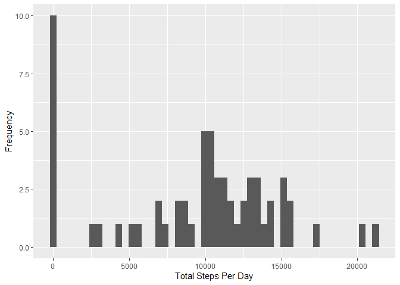
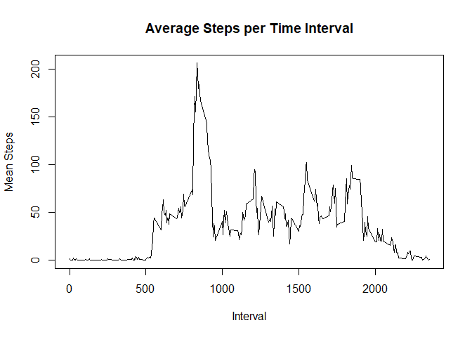
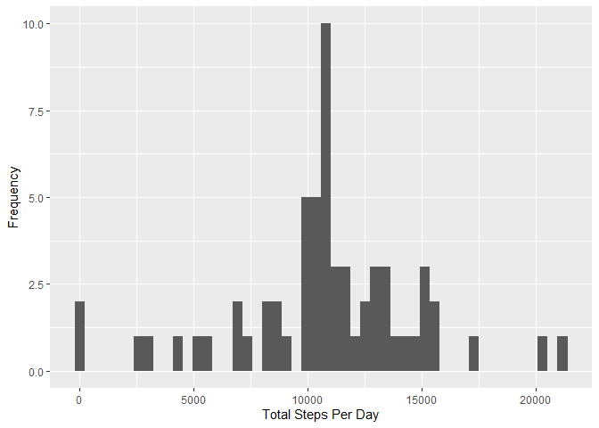
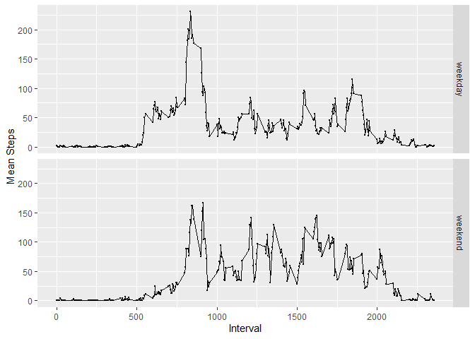

## Loading and preprocessing the data
We use the ```ggplot2``` package to plot the data:

```r
library(ggplot2)
```

The data is available in a ZIP file, we can extract the data and read it in to a data frame:

```r
unzip("activity.zip")
activity <- read.csv("activity.csv")
```

No additional processing is required to clean-up the dataset.

## What is mean total number of steps taken per day?

From the activity data, we create an array of the number of steps taken per day:

```r
stepsPerDay <- tapply(activity$steps, activity$date, sum, na.rm = TRUE)
```

We display this this data in a histogram showing the distribution of steps per day:

```r
qplot(stepsPerDay, xlab = "Total Steps Per Day", ylab= "Frequency", bins = 50)
```

<!-- -->

The same array can provide the mean and median steps per day:

```r
stepsPerDay.mean   <- mean(stepsPerDay)
stepsPerDay.median <- median(stepsPerDay)
```

This tells us:

- Steps per Day (mean):   9354.23.
- Steps per Day (median): 10395.

## What is the average daily activity pattern?

From the activity data, we create an array of the mean number of steps taken in each timer interval. 
We then plot:

```r
avgStepsPerInterval <- tapply(activity$steps, activity$interval, mean, na.rm = TRUE)
intervals           <- levels(as.factor(activity$interval))
plot(intervals, avgStepsPerInterval, type = "l", 
     main = "Average Steps per Time Interval", 
     xlab = "Interval", 
     ylab = "Mean Steps")
```

<!-- -->

Using the same array we can find the time interval in which the most steps are recorded:

```r
interval.max <- names(which.max(avgStepsPerInterval))
```
The maximum number of steps is taken in interval 835.

## Imputing missing values
We can find the number of missing step entries by counting the number of NAs:

```r
steps.missing <- sum(is.na(activity$steps))
```

This indicates that there are 2304 incomplete records.

Our strategy for filling in the missing values in the dataset is to replace them with the mean value for the time interval.

We create a new data frame, replacing the any NA steps with the mean value obtained from the `avgStepsPerInterval` array we created earlier:


```r
activity.imputed      <- transform(activity, 
                            steps = ifelse(is.na(steps), avgStepsPerInterval, steps))
steps.imputed.missing <- sum(is.na(activity.imputed$steps))
```

So there are 0 incomplete records in the imputed array.

We can now use the imputed data and the technique we used earlier to re-calculate the histogram showing the distribution of steps per day:

```r
stepsPerDay.imputed <- tapply(activity.imputed$steps, activity.imputed$date, sum, na.rm = TRUE)
qplot(stepsPerDay.imputed, xlab = "Total Steps Per Day", ylab= "Frequency", bins = 50)
```

<!-- -->

We can also recalculate the mean and median steps per day:

```r
stepsPerDay.imputed.mean   <- mean(stepsPerDay.imputed)
stepsPerDay.imputed.median <- median(stepsPerDay.imputed)
```

This tells us:

- Steps per Day (mean):   10766.19.
- Steps per Day (median): 10766.

Imputting the missing step data has reduced the frequency of the zero-step intervals and distributed, allocating the data to different bins. Consequently, the mean and median values have increased.

## Are there differences in activity patterns between weekdays and weekends?
We add a factor indicating whether the day is a weekday or weekend:

```r
activity.imputed$dayType <- as.factor(ifelse(as.POSIXlt(activity.imputed$date)$wday %in% c(0,6),
                                             'weekend', 'weekday'))
```

We calculate the steps per interval per day type based on the imputed data and plot the data for weekend and weekdays.

```r
intervalDayType <- aggregate(steps ~ interval + dayType, activity.imputed, mean)
qplot(interval, steps, data = intervalDayType, facets = dayType ~ ., 
      xlab = "Interval", 
      ylab= "Mean Steps", 
      size=I(0)) + 
  geom_line()
```

<!-- -->

